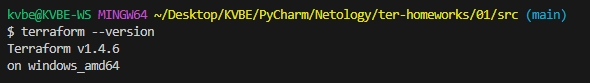
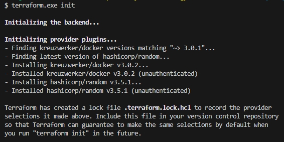
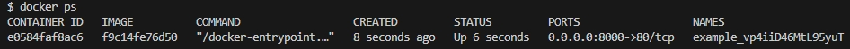
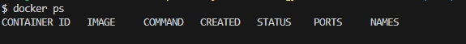

# Ответы на домашнее задание к занятию «Введение в Terraform»


Скачайте и установите актуальную версию terraform >=1.4.X . Приложите скриншот вывода команды terraform --version.



### Задание 1

1. Перейдите в каталог [**src**](https://github.com/netology-code/ter-homeworks/tree/main/01/src). Скачайте все необходимые зависимости, использованные в проекте. 




2. Изучите файл **.gitignore**. В каком terraform файле согласно этому .gitignore допустимо сохранить личную, секретную информацию?
>*.tfstate
>
>*.tfstate.*


3. Выполните код проекта. Найдите  в State-файле секретное содержимое созданного ресурса **random_password**, пришлите в качестве ответа конкретный ключ и его значение.

>"random_password.random_string.result": "vp4iiD46MtL95yuT"


4. Раскомментируйте блок кода, примерно расположенный на строчках 29-42 файла **main.tf**.
Выполните команду ```terraform validate```. Объясните в чем заключаются намеренно допущенные ошибки? Исправьте их.

>Ошибка 1. У ресурса ```docker_image``` не хватает второго лейбла (имени). Исправлено на ```resource "docker_image" "nginx" {```
>
>Ошибка 2. Здесь опишу сразу 2 ошибки. Неверно указано значение ```random_password.random_string_fake.resuld```, т.к. не был объявлен ресурс ```"random_password" "random_string_fake"```, есть только ресурс ``` "random_password" "random_string"```. И нет ключа с именем ```resuld```, есть ключ с именем ```result```. Исправлено на ```name  = "example_${random_password.random_string.result}"```
>
>Ошибка 3. Второй лейбл (имя) ресурса ```docker_container``` указано не верно. Имя ресурса может начинаться только с буквы или знака подчеркивания. Исправлено на ```resource "docker_container" "nginx" {```


5. Выполните код. В качестве ответа приложите вывод команды ```docker ps```



6. Замените имя docker-контейнера в блоке кода на ```hello_world```, выполните команду ```terraform apply -auto-approve```. Объясните своими словами, в чем может быть опасность применения ключа  ```-auto-approve``` ? В качестве ответа дополнительно приложите вывод команды ```docker ps```



>Ключ -auto-approve позволяет без запроса подтверждения внести изменения в инфраструктуру, в этом и заключается опасность его применения, т.к. никем не выполяется проверка вносимых изменений. В данном случае новый контейнер не был создан из-за конфликта имени контейнера - имя контейнера уже используется, а имеющийся контейнер на следующем шаге был удален. В итоге не остальсо ни старого контейнера, ни нового.


7. Уничтожьте созданные ресурсы с помощью **terraform**. Убедитесь, что все ресурсы удалены. Приложите содержимое файла **terraform.tfstate**.
```
{
    "version": 4,
    "terraform_version": "1.4.6",
    "serial": 15,
    "lineage": "bbbfe126-1b72-5369-5154-7ca19c4a84d1",
    "outputs": {},
    "resources": [],
    "check_results": null
}
```

8. Объясните, почему при этом не был удален docker образ **nginx:latest** ? Ответ подкрепите выдержкой из документации провайдера.
>Образ не был удален, т.к. значение keep_locally = true
>
>```keep_locally (Boolean) If true, then the Docker image won't be deleted on destroy operation. If this is false, it will delete the image from the docker local storage on destroy operation.```


### Задание 2*

1. Изучите в документации provider [**Virtualbox**](https://registry.tfpla.net/providers/shekeriev/virtualbox/latest/docs/overview/index) от 
shekeriev.
2. Создайте с его помощью любую виртуальную машину. Чтобы не использовать VPN советуем выбрать любой образ с расположением в github из [**списка**](https://www.vagrantbox.es/)

```
terraform {
  required_providers {
    virtualbox = {
      source = "shekeriev/virtualbox"
      version = "0.0.4"
    }
  }
}

provider "virtualbox" {
  delay      = 60
  mintimeout = 5
}

resource "virtualbox_vm" "vm1" {
  name   = "freebsd"
  image  = "http://dlang.dawg.eu/vagrant/FreeBSD-8.4-amd64.box"
  cpus   = 1
  memory    = "512 mib"

  network_adapter {
    type           = "hostonly"
    host_interface = "VirtualBox Host-Only Ethernet Adapter"
  }
}
```