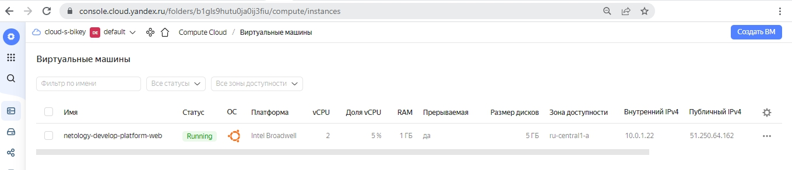
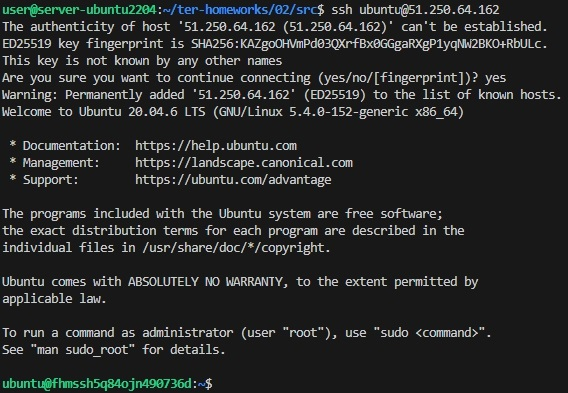
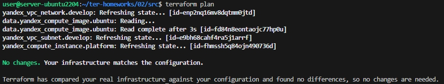
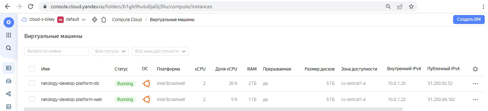
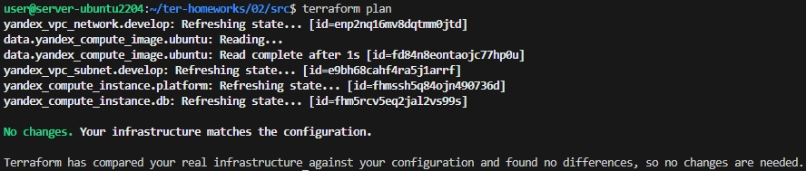

# Ответы на домашнее задание к занятию «Основы Terraform. Yandex Cloud»

>Приложил код (каталог **src**) со всеми исправлениями


### Цель задания

1. Создать свои ресурсы в облаке Yandex Cloud с помощью Terraform.
2. Освоить работу с переменными Terraform.


### Чеклист готовности к домашнему заданию

1. Зарегистрирован аккаунт в Yandex Cloud. Использован промокод на грант.
2. Установлен инструмент Yandex Cli.
3. Исходный код для выполнения задания расположен в директории [**02/src**](https://github.com/netology-code/ter-homeworks/tree/main/02/src).


### Задание 0

1. Ознакомьтесь с [документацией к security-groups в Yandex Cloud](https://cloud.yandex.ru/docs/vpc/concepts/security-groups?from=int-console-help-center-or-nav).
2. Запросите preview доступ к данному функционалу в ЛК Yandex Cloud. Обычно его выдают в течении 24-х часов.
https://console.cloud.yandex.ru/folders/<ваш cloud_id>/vpc/security-groups.   
Этот функционал понадобится к следующей лекции. 

>Запрос на доступ отправлен

### Задание 1

1. Изучите проект. В файле variables.tf объявлены переменные для yandex provider.
2. Переименуйте файл personal.auto.tfvars_example в personal.auto.tfvars. Заполните переменные (идентификаторы облака, токен доступа). Благодаря .gitignore этот файл не попадет в публичный репозиторий. **Вы можете выбрать иной способ безопасно передать секретные данные в terraform.**
3. Сгенерируйте или используйте свой текущий ssh ключ. Запишите его открытую часть в переменную **vms_ssh_root_key**.
4. Инициализируйте проект, выполните код. Исправьте намеренное допущенные ошибки. Ответьте в чем заключается их суть?

>Указан не существующий platform_id (в данном случае можно выбрать значение по умолчанию - standard-v1) и количество ядер должно быть кратное двум.

5. Ответьте, как в процессе обучения могут пригодиться параметры```preemptible = true``` и ```core_fraction=5``` в параметрах ВМ? Ответ в документации Yandex cloud.

>Эти два параметра позволяют экономить ресурсы и бюджет. В процессе обущения это может пригодиться, если, например, забыть удалить ВМ. Параметр ```preemptible = true``` делает ВМ прерываемыми (https://cloud.yandex.ru/docs/compute/concepts/preemptible-vm). Параметр ```core_fraction=5``` ограничивает долю vCPU - для тестовых ВМ этого вполне может быть достаточно, если не запускать на них ресурсоёкие сервисы.

В качестве решения приложите:
- скриншот ЛК Yandex Cloud с созданной ВМ,
- скриншот успешного подключения к консоли ВМ через ssh,
- ответы на вопросы.






### Задание 2

1. Изучите файлы проекта.
2. Замените все "хардкод" **значения** для ресурсов **yandex_compute_image** и **yandex_compute_instance** на **отдельные** переменные. К названиям переменных ВМ добавьте в начало префикс **vm_web_** .  Пример: **vm_web_name**.
2. Объявите нужные переменные в файле variables.tf, обязательно указывайте тип переменной. Заполните их **default** прежними значениями из main.tf. 
3. Проверьте terraform plan (изменений быть не должно). 




### Задание 3

1. Создайте в корне проекта файл 'vms_platform.tf' . Перенесите в него все переменные первой ВМ.
2. Скопируйте блок ресурса и создайте с его помощью вторую ВМ(в файле main.tf): **"netology-develop-platform-db"** ,  cores  = 2, memory = 2, core_fraction = 20. Объявите ее переменные с префиксом **vm_db_** в том же файле('vms_platform.tf').
3. Примените изменения.




### Задание 4

1. Объявите в файле outputs.tf output типа map, содержащий { instance_name = external_ip } для каждой из ВМ.
2. Примените изменения.

В качестве решения приложите вывод значений ip-адресов команды ```terraform output```

```
user@server-ubuntu2204:~/ter-homeworks/02/src$ terraform output
instance_external_ip = {
  "netology-develop-platform-db" = "51.250.92.52"
  "netology-develop-platform-web" = "51.250.64.162"
}
```


### Задание 5

1. В файле locals.tf опишите в **одном** local-блоке имя каждой ВМ, используйте интерполяцию ${..} с несколькими переменными по примеру из лекции.
2. Замените переменные с именами ВМ из файла variables.tf на созданные вами local переменные.
3. Примените изменения.

```
user@server-ubuntu2204:~/ter-homeworks/02/src$ terraform apply
data.yandex_compute_image.ubuntu: Reading...
yandex_vpc_network.develop: Refreshing state... [id=enp2nq16mv8dqtmm0jtd]
data.yandex_compute_image.ubuntu: Read complete after 0s [id=fd84n8eontaojc77hp0u]
yandex_vpc_subnet.develop: Refreshing state... [id=e9bh68cahf4ra5j1arrf]
yandex_compute_instance.db: Refreshing state... [id=fhm5rcv5eq2jal2vs99s]
yandex_compute_instance.platform: Refreshing state... [id=fhmssh5q84ojn490736d]

No changes. Your infrastructure matches the configuration.

Terraform has compared your real infrastructure against your configuration and found no differences, so no changes are needed.

Apply complete! Resources: 0 added, 0 changed, 0 destroyed.

Outputs:

instance_external_ip = {
  "netology-develop-platform-db" = "51.250.92.52"
  "netology-develop-platform-web" = "51.250.64.162"
}
```


### Задание 6
1. Вместо использования 3-х переменных  ".._cores",".._memory",".._core_fraction" в блоке  resources {...}, объедените их в переменные типа **map** с именами "vm_web_resources" и "vm_db_resources". В качестве продвинутой практики попробуйте создать одну map переменную **vms_resources** и уже внутри нее конфиги обеих ВМ(вложенный map).
2. Так же поступите с блоком **metadata {serial-port-enable, ssh-keys}**, эта переменная должна быть общая для всех ваших ВМ.
3. Найдите и удалите все более не используемые переменные проекта.
4. Проверьте terraform plan (изменений быть не должно).




### Задание 7*

Изучите содержимое файла console.tf. Откройте terraform console, выполните следующие задания: 

1. Напишите, какой командой можно отобразить **второй** элемент списка test_list?

```
> local.test_list[1]
"staging"
```

2. Найдите длину списка test_list с помощью функции length(<имя переменной>).

```
> length(local.test_list)
3
```

3. Напишите, какой командой можно отобразить значение ключа admin из map test_map ?

```
> local.test_map.user
"Alex"

ИЛИ

> local.test_map["user"]
"Alex"
```

4. Напишите interpolation выражение, результатом которого будет: "John is admin for production server based on OS ubuntu-20-04 with X vcpu, Y ram and Z virtual disks", используйте данные из переменных test_list, test_map, servers и функцию length() для подстановки значений.

```
> "${local.test_map.admin} is admin for ${local.test_list[2]} server based on OS ${local.servers.production.image} with ${local.servers.production.cpu} vcpu, ${local.servers.production.ram} ram and ${length(local.servers.production.disks)} virtual disks"
"John is admin for production server based on OS ubuntu-20-04 with 10 vcpu, 40 ram and 4 virtual disks"
```

В качестве решения предоставьте необходимые команды и их вывод. 
