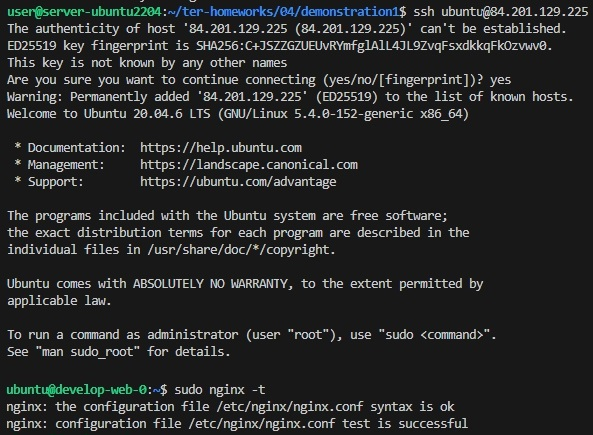

# Ответы на домашнее задание к занятию "Продвинутые методы работы с Terraform"

### Цель задания

1. Научиться использовать модули.
2. Отработать операции state.
3. Закрепить пройденный материал.


### Чеклист готовности к домашнему заданию

1. Зарегистрирован аккаунт в Yandex Cloud. Использован промокод на грант.
2. Установлен инструмент yandex CLI
3. Исходный код для выполнения задания расположен в директории [**04/src**](https://github.com/netology-code/ter-homeworks/tree/main/04/src).
4. Любые ВМ, использованные при выполнении задания должны быть прерываемыми, для экономии средств.

------

### Задание 1

1. Возьмите из [демонстрации к лекции готовый код](https://github.com/netology-code/ter-homeworks/tree/main/04/demonstration1) для создания ВМ с помощью remote модуля.
2. Создайте 1 ВМ, используя данный модуль. В файле cloud-init.yml необходимо использовать переменную для ssh ключа вместо хардкода. Передайте ssh-ключ в функцию template_file в блоке vars ={} .
Воспользуйтесь [**примером**](https://grantorchard.com/dynamic-cloudinit-content-with-terraform-file-templates/). Обратите внимание что ssh-authorized-keys принимает в себя список, а не строку!
3. Добавьте в файл cloud-init.yml установку nginx.
4. Предоставьте скриншот подключения к консоли и вывод команды ```sudo nginx -t```.



[Код](src/demonstration1)

------

### Задание 2

1. Напишите локальный модуль vpc, который будет создавать 2 ресурса: **одну** сеть и **одну** подсеть в зоне, объявленной при вызове модуля. например: ```ru-central1-a```.
2. Модуль должен возвращать значения vpc.id и subnet.id
3. Замените ресурсы yandex_vpc_network и yandex_vpc_subnet, созданным модулем.
4. Сгенерируйте документацию к модулю с помощью terraform-docs.    
 
Пример вызова:
```
module "vpc_dev" {
  source       = "./vpc"
  env_name     = "develop"
  zone = "ru-central1-a"
  cidr = "10.0.1.0/24"
}
```


---
>Вывод terraform-docs

## Requirements

| Name | Version |
|------|---------|
| <a name="requirement_terraform"></a> [terraform](#requirement\_terraform) | >=0.13 |

## Providers

| Name | Version |
|------|---------|
| <a name="provider_template"></a> [template](#provider\_template) | 2.2.0 |

## Modules

| Name | Source | Version |
|------|--------|---------|
| <a name="module_test-vm"></a> [test-vm](#module\_test-vm) | git::https://github.com/udjin10/yandex_compute_instance.git | main |
| <a name="module_vpc_dev"></a> [vpc\_dev](#module\_vpc\_dev) | ./vpc | n/a |

## Resources

| Name | Type |
|------|------|
| [template_file.cloudinit](https://registry.terraform.io/providers/hashicorp/template/latest/docs/data-sources/file) | data source |

## Inputs

| Name | Description | Type | Default | Required |
|------|-------------|------|---------|:--------:|
| <a name="input_cloud_id"></a> [cloud\_id](#input\_cloud\_id) | https://cloud.yandex.ru/docs/resource-manager/operations/cloud/get-id | `string` | n/a | yes |
| <a name="input_default_cidr"></a> [default\_cidr](#input\_default\_cidr) | https://cloud.yandex.ru/docs/vpc/operations/subnet-create | `string` | `"10.0.1.0/24"` | no |
| <a name="input_default_zone"></a> [default\_zone](#input\_default\_zone) | https://cloud.yandex.ru/docs/overview/concepts/geo-scope | `string` | `"ru-central1-a"` | no |
| <a name="input_env_name"></a> [env\_name](#input\_env\_name) | n/a | `string` | `"develop"` | no |
| <a name="input_folder_id"></a> [folder\_id](#input\_folder\_id) | https://cloud.yandex.ru/docs/resource-manager/operations/folder/get-id | `string` | n/a | yes |
| <a name="input_image_family"></a> [image\_family](#input\_image\_family) | n/a | `string` | `"ubuntu-2004-lts"` | no |
| <a name="input_instance_count"></a> [instance\_count](#input\_instance\_count) | n/a | `number` | `2` | no |
| <a name="input_instance_name"></a> [instance\_name](#input\_instance\_name) | n/a | `string` | `"web"` | no |
| <a name="input_public_ip"></a> [public\_ip](#input\_public\_ip) | n/a | `bool` | `true` | no |
| <a name="input_public_key"></a> [public\_key](#input\_public\_key) | n/a | `string` | `"~/.ssh/id_rsa.pub"` | no |
| <a name="input_token"></a> [token](#input\_token) | OAuth-token; https://cloud.yandex.ru/docs/iam/concepts/authorization/oauth-token | `string` | n/a | yes |
| <a name="input_vpc_name"></a> [vpc\_name](#input\_vpc\_name) | VPC network&subnet name | `string` | `"develop"` | no |

## Outputs

No outputs.

---


### Задание 3
1. Выведите список ресурсов в стейте.
2. Удалите из стейта модуль vpc.
3. Импортируйте его обратно. Проверьте terraform plan - изменений быть не должно.
Приложите список выполненных команд и вывод.

>terraform state list
```
data.template_file.cloudinit
module.test-vm.data.yandex_compute_image.my_image
module.test-vm.yandex_compute_instance.vm[0]
module.test-vm.yandex_compute_instance.vm[1]
module.vpc_dev.yandex_vpc_network.develop
module.vpc_dev.yandex_vpc_subnet.develop
```

>terraform state rm 'module.vpc_dev.yandex_vpc_network.develop'
```
Removed module.vpc_dev.yandex_vpc_network.develop
Successfully removed 1 resource instance(s).
```

>terraform state rm 'module.vpc_dev.yandex_vpc_subnet.develop'
```
Removed module.vpc_dev.yandex_vpc_subnet.develop
Successfully removed 1 resource instance(s).
```

>terraform import 'module.vpc_dev.yandex_vpc_network.develop' enpgunuaquliadbacbdc
```
data.template_file.cloudinit: Reading...
data.template_file.cloudinit: Read complete after 0s [id=062746d906a4da6c690dfc1b646527bce7122b30b34be2dc45a4ccff28fedeb3]
module.vpc_dev.yandex_vpc_network.develop: Importing from ID "enpgunuaquliadbacbdc"...
module.vpc_dev.yandex_vpc_network.develop: Import prepared!
  Prepared yandex_vpc_network for import
module.vpc_dev.yandex_vpc_network.develop: Refreshing state... [id=enpgunuaquliadbacbdc]
module.test-vm.data.yandex_compute_image.my_image: Reading...
module.test-vm.data.yandex_compute_image.my_image: Read complete after 0s [id=fd84n8eontaojc77hp0u]

Import successful!

The resources that were imported are shown above. These resources are now in
your Terraform state and will henceforth be managed by Terraform.
```

>terraform import 'module.vpc_dev.yandex_vpc_subnet.develop' e9b77htm96hqtggv2m40
```
data.template_file.cloudinit: Reading...
data.template_file.cloudinit: Read complete after 0s [id=062746d906a4da6c690dfc1b646527bce7122b30b34be2dc45a4ccff28fedeb3]
module.test-vm.data.yandex_compute_image.my_image: Reading...
module.vpc_dev.yandex_vpc_subnet.develop: Importing from ID "e9b77htm96hqtggv2m40"...
module.vpc_dev.yandex_vpc_subnet.develop: Import prepared!
  Prepared yandex_vpc_subnet for import
module.vpc_dev.yandex_vpc_subnet.develop: Refreshing state... [id=e9b77htm96hqtggv2m40]
module.test-vm.data.yandex_compute_image.my_image: Read complete after 1s [id=fd84n8eontaojc77hp0u]

Import successful!

The resources that were imported are shown above. These resources are now in
your Terraform state and will henceforth be managed by Terraform.
```

>terraform plan
```
data.template_file.cloudinit: Reading...
data.template_file.cloudinit: Read complete after 0s [id=062746d906a4da6c690dfc1b646527bce7122b30b34be2dc45a4ccff28fedeb3]
module.vpc_dev.yandex_vpc_network.develop: Refreshing state... [id=enpgunuaquliadbacbdc]
module.test-vm.data.yandex_compute_image.my_image: Reading...
module.test-vm.data.yandex_compute_image.my_image: Read complete after 1s [id=fd84n8eontaojc77hp0u]
module.vpc_dev.yandex_vpc_subnet.develop: Refreshing state... [id=e9b77htm96hqtggv2m40]
module.test-vm.yandex_compute_instance.vm[0]: Refreshing state... [id=fhmnmjj6ivqc9n9uj0gm]
module.test-vm.yandex_compute_instance.vm[1]: Refreshing state... [id=fhm1u4ht893m5tenb1fs]

No changes. Your infrastructure matches the configuration.

Terraform has compared your real infrastructure against your configuration and found no differences, so no changes are needed.
```

[Код модуля vpc](src/demonstration1/vpc)


## Дополнительные задания (со звездочкой*)

**Настоятельно рекомендуем выполнять все задания под звёздочкой.**   Их выполнение поможет глубже разобраться в материале.   
Задания под звёздочкой дополнительные (необязательные к выполнению) и никак не повлияют на получение вами зачета по этому домашнему заданию. 


### Задание 4*

1. Измените модуль vpc так, чтобы он мог создать подсети во всех зонах доступности, переданных в переменной типа list(object) при вызове модуля.  
  
Пример вызова:
```
module "vpc_prod" {
  source       = "./vpc"
  env_name     = "production"
  subnets = [
    { zone = "ru-central1-a", cidr = "10.0.1.0/24" },
    { zone = "ru-central1-b", cidr = "10.0.2.0/24" },
    { zone = "ru-central1-c", cidr = "10.0.3.0/24" },
  ]
}

module "vpc_dev" {
  source       = "./vpc"
  env_name     = "develop"
  subnets = [
    { zone = "ru-central1-a", cidr = "10.0.1.0/24" },
  ]
}
```

Предоставьте код, план выполнения, результат из консоли YC.

[Код модуля vpc](src/demonstration1/vpc)

```
user@server-ubuntu2204:~/ter-homeworks/04/demonstration1$ terraform plan
data.template_file.cloudinit: Reading...
data.template_file.cloudinit: Read complete after 0s [id=062746d906a4da6c690dfc1b646527bce7122b30b34be2dc45a4ccff28fedeb3]
module.test-vm.data.yandex_compute_image.my_image: Reading...
module.test-vm.data.yandex_compute_image.my_image: Read complete after 1s [id=fd84n8eontaojc77hp0u]

Terraform used the selected providers to generate the following execution plan. Resource actions are indicated with the following symbols:
  + create

Terraform will perform the following actions:

  # module.test-vm.yandex_compute_instance.vm[0] will be created
  + resource "yandex_compute_instance" "vm" {
      + allow_stopping_for_update = true
      + created_at                = (known after apply)
      + description               = "TODO: description; {{terraform managed}}"
      + folder_id                 = (known after apply)
      + fqdn                      = (known after apply)
      + gpu_cluster_id            = (known after apply)
      + hostname                  = "develop-web-0"
      + id                        = (known after apply)
      + labels                    = {
          + "env"     = "develop"
          + "project" = "undefined"
        }
      + metadata                  = {
          + "serial-port-enable" = "1"
          + "user-data"          = <<-EOT
                #cloud-config
                users:
                  - name: ubuntu
                    groups: sudo
                    shell: /bin/bash
                    sudo: ['ALL=(ALL) NOPASSWD:ALL']
                    ssh_authorized_keys:
                      - ssh-rsa AAAAB3NzaC1yc2EAAAADAQABAAABgQCt2SubO/xRwmA/9RZwYtj56u6glkI36287b9stLz6rVPtosmpYxmUZmIOiqE1c5m7mw3A+e3PcRQgdrHlWdsrtO+GGsLBfLRElycd3/iZvcTPK+PQfPV1cBvE41DdrIoSEWk52pxa1LQiVtNBAQCXKP/Y0sKBwChsQ21Q4yPR6kzwafUha9IUou4jbQGL/6raEiC6taY7XYB6P14JQGjz7Z751XEJSp4rZhJEsyrFabA7CILTelD1dlklZfrRhGr50Z1PKXYLJkHVJYFHVfkpvot+mr/lfeX+wuQoemOp7QQpQSICicgT6vw1mpREYWL7xr4L0NzBJ/ag4xR4jKO7p+9I72MqeJ52ngrnaWVAOxkUJufAp3TjE01RXch/QTR4FrCbkP6KNqJR96gdaL1Es9DyRNYOpOLfvBe/ySXKEe5wxnzZJHqeSH2A6RZjznhngi4AaoYEv/Gsvt7Q+7ONecYyiYkduAen7TPW3+akhOmIcSftGhFS3b4Zis2xTK+c= user@server-ubuntu2204     

                package_update: true
                package_upgrade: false
                packages:
                 - vim
                 - nginx
            EOT
        }
      + name                      = "develop-web-0"
      + network_acceleration_type = "standard"
      + platform_id               = "standard-v1"
      + service_account_id        = (known after apply)
      + status                    = (known after apply)
      + zone                      = "ru-central1-c"

      + boot_disk {
          + auto_delete = true
          + device_name = (known after apply)
          + disk_id     = (known after apply)
          + mode        = (known after apply)

          + initialize_params {
              + block_size  = (known after apply)
              + description = (known after apply)
              + image_id    = "fd84n8eontaojc77hp0u"
              + name        = (known after apply)
              + size        = 10
              + snapshot_id = (known after apply)
              + type        = "network-hdd"
            }
        }

      + network_interface {
          + index              = (known after apply)
          + ip_address         = (known after apply)
          + ipv4               = true
          + ipv6               = (known after apply)
          + ipv6_address       = (known after apply)
          + mac_address        = (known after apply)
          + nat                = true
          + nat_ip_address     = (known after apply)
          + nat_ip_version     = (known after apply)
          + security_group_ids = (known after apply)
          + subnet_id          = (known after apply)
        }

      + resources {
          + core_fraction = 5
          + cores         = 2
          + memory        = 1
        }

      + scheduling_policy {
          + preemptible = true
        }
    }

  # module.test-vm.yandex_compute_instance.vm[1] will be created
  + resource "yandex_compute_instance" "vm" {
      + allow_stopping_for_update = true
      + created_at                = (known after apply)
      + description               = "TODO: description; {{terraform managed}}"
      + folder_id                 = (known after apply)
      + fqdn                      = (known after apply)
      + gpu_cluster_id            = (known after apply)
      + hostname                  = "develop-web-1"
      + id                        = (known after apply)
      + labels                    = {
          + "env"     = "develop"
          + "project" = "undefined"
        }
      + metadata                  = {
          + "serial-port-enable" = "1"
          + "user-data"          = <<-EOT
                #cloud-config
                users:
                  - name: ubuntu
                    groups: sudo
                    shell: /bin/bash
                    sudo: ['ALL=(ALL) NOPASSWD:ALL']
                    ssh_authorized_keys:
                      - ssh-rsa AAAAB3NzaC1yc2EAAAADAQABAAABgQCt2SubO/xRwmA/9RZwYtj56u6glkI36287b9stLz6rVPtosmpYxmUZmIOiqE1c5m7mw3A+e3PcRQgdrHlWdsrtO+GGsLBfLRElycd3/iZvcTPK+PQfPV1cBvE41DdrIoSEWk52pxa1LQiVtNBAQCXKP/Y0sKBwChsQ21Q4yPR6kzwafUha9IUou4jbQGL/6raEiC6taY7XYB6P14JQGjz7Z751XEJSp4rZhJEsyrFabA7CILTelD1dlklZfrRhGr50Z1PKXYLJkHVJYFHVfkpvot+mr/lfeX+wuQoemOp7QQpQSICicgT6vw1mpREYWL7xr4L0NzBJ/ag4xR4jKO7p+9I72MqeJ52ngrnaWVAOxkUJufAp3TjE01RXch/QTR4FrCbkP6KNqJR96gdaL1Es9DyRNYOpOLfvBe/ySXKEe5wxnzZJHqeSH2A6RZjznhngi4AaoYEv/Gsvt7Q+7ONecYyiYkduAen7TPW3+akhOmIcSftGhFS3b4Zis2xTK+c= user@server-ubuntu2204     

                package_update: true
                package_upgrade: false
                packages:
                 - vim
                 - nginx
            EOT
        }
      + name                      = "develop-web-1"
      + network_acceleration_type = "standard"
      + platform_id               = "standard-v1"
      + service_account_id        = (known after apply)
      + status                    = (known after apply)
      + zone                      = "ru-central1-c"

      + boot_disk {
          + auto_delete = true
          + device_name = (known after apply)
          + disk_id     = (known after apply)
          + mode        = (known after apply)

          + initialize_params {
              + block_size  = (known after apply)
              + description = (known after apply)
              + image_id    = "fd84n8eontaojc77hp0u"
              + name        = (known after apply)
              + size        = 10
              + snapshot_id = (known after apply)
              + type        = "network-hdd"
            }
        }

      + network_interface {
          + index              = (known after apply)
          + ip_address         = (known after apply)
          + ipv4               = true
          + ipv6               = (known after apply)
          + ipv6_address       = (known after apply)
          + mac_address        = (known after apply)
          + nat                = true
          + nat_ip_address     = (known after apply)
          + nat_ip_version     = (known after apply)
          + security_group_ids = (known after apply)
          + subnet_id          = (known after apply)
        }

      + resources {
          + core_fraction = 5
          + cores         = 2
          + memory        = 1
        }

      + scheduling_policy {
          + preemptible = true
        }
    }

  # module.vpc_dev.yandex_vpc_network.develop will be created
  + resource "yandex_vpc_network" "develop" {
      + created_at                = (known after apply)
      + default_security_group_id = (known after apply)
      + folder_id                 = (known after apply)
      + id                        = (known after apply)
      + labels                    = (known after apply)
      + name                      = "develop"
      + subnet_ids                = (known after apply)
    }

  # module.vpc_dev.yandex_vpc_subnet.develop["ru-central1-a"] will be created
  + resource "yandex_vpc_subnet" "develop" {
      + created_at     = (known after apply)
      + folder_id      = (known after apply)
      + id             = (known after apply)
      + labels         = (known after apply)
      + name           = "develop-ru-central1-a"
      + network_id     = (known after apply)
      + v4_cidr_blocks = [
          + "10.0.1.0/24",
        ]
      + v6_cidr_blocks = (known after apply)
      + zone           = "ru-central1-a"
    }

  # module.vpc_dev.yandex_vpc_subnet.develop["ru-central1-b"] will be created
  + resource "yandex_vpc_subnet" "develop" {
      + created_at     = (known after apply)
      + folder_id      = (known after apply)
      + id             = (known after apply)
      + labels         = (known after apply)
      + name           = "develop-ru-central1-b"
      + network_id     = (known after apply)
      + v4_cidr_blocks = [
          + "10.0.2.0/24",
        ]
      + v6_cidr_blocks = (known after apply)
      + zone           = "ru-central1-b"
    }

  # module.vpc_dev.yandex_vpc_subnet.develop["ru-central1-c"] will be created
  + resource "yandex_vpc_subnet" "develop" {
      + created_at     = (known after apply)
      + folder_id      = (known after apply)
      + id             = (known after apply)
      + labels         = (known after apply)
      + name           = "develop-ru-central1-c"
      + network_id     = (known after apply)
      + v4_cidr_blocks = [
          + "10.0.3.0/24",
        ]
      + v6_cidr_blocks = (known after apply)
      + zone           = "ru-central1-c"
    }

Plan: 6 to add, 0 to change, 0 to destroy.

────────────────────────────────────────────────────────────────────────────────────────────────────────────────────────────────────────────────────── 

Note: You didn't use the -out option to save this plan, so Terraform can't guarantee to take exactly these actions if you run "terraform apply" now.
```


### Задание 5***

1. Напишите модуль для создания кластера managed БД Mysql в Yandex Cloud с 1 или 3 хостами в зависимости от переменной HA=true или HA=false. Используйте ресурс yandex_mdb_mysql_cluster (передайте имя кластера и id сети).
2. Напишите модуль для создания базы данных и пользователя в уже существующем кластере managed БД Mysql. Используйте ресурсы yandex_mdb_mysql_database и yandex_mdb_mysql_user (передайте имя базы данных, имя пользователя и id кластера при вызове модуля).
3. Используя оба модуля, создайте кластер example из одного хоста, а затем добавьте в него БД test и пользователя app. Затем измените переменную и превратите сингл хост в кластер из 2х серверов.
4. 
Предоставьте план выполнения и по-возможности результат. Сразу же удаляйте созданные ресурсы, так как кластер может стоить очень дорого! Используйте минимальную конфигурацию.


```
$ terraform plan

Terraform used the selected providers to generate the following execution plan. Resource actions are indicated with the following symbols:
  + create

Terraform will perform the following actions:

  # module.mysql_cluster.yandex_mdb_mysql_cluster.cluster will be created
  + resource "yandex_mdb_mysql_cluster" "cluster" {
      + allow_regeneration_host   = false
      + backup_retain_period_days = (known after apply)
      + created_at                = (known after apply)
      + deletion_protection       = (known after apply)
      + environment               = "PRESTABLE"
      + folder_id                 = (known after apply)
      + health                    = (known after apply)
      + host_group_ids            = (known after apply)
      + id                        = (known after apply)
      + mysql_config              = (known after apply)
      + name                      = "example"
      + network_id                = (known after apply)
      + status                    = (known after apply)
      + version                   = "5.7"

      + host {
          + assign_public_ip   = false
          + fqdn               = (known after apply)
          + name               = "host-1"
          + replication_source = (known after apply)
          + subnet_id          = (known after apply)
          + zone               = "ru-central1-a"
        }

      + resources {
          + disk_size          = 10
          + disk_type_id       = "network-hdd"
          + resource_preset_id = "b1.medium"
        }
    }

  # module.vpc_dev.yandex_vpc_network.develop will be created
  + resource "yandex_vpc_network" "develop" {
      + created_at                = (known after apply)
      + default_security_group_id = (known after apply)
      + folder_id                 = (known after apply)
      + id                        = (known after apply)
      + labels                    = (known after apply)
      + name                      = "develop"
      + subnet_ids                = (known after apply)
    }

  # module.vpc_dev.yandex_vpc_subnet.develop["ru-central1-a"] will be created
  + resource "yandex_vpc_subnet" "develop" {
      + created_at     = (known after apply)
      + folder_id      = (known after apply)
      + id             = (known after apply)
      + labels         = (known after apply)
      + name           = "develop-ru-central1-a"
      + network_id     = (known after apply)
      + v4_cidr_blocks = [
          + "10.0.1.0/24",
        ]
      + v6_cidr_blocks = (known after apply)
      + zone           = "ru-central1-a"
    }

  # module.vpc_dev.yandex_vpc_subnet.develop["ru-central1-b"] will be created
  + resource "yandex_vpc_subnet" "develop" {
      + created_at     = (known after apply)
      + folder_id      = (known after apply)
      + id             = (known after apply)
      + labels         = (known after apply)
      + name           = "develop-ru-central1-b"
      + network_id     = (known after apply)
      + v4_cidr_blocks = [
          + "10.0.2.0/24",
        ]
      + v6_cidr_blocks = (known after apply)
      + zone           = "ru-central1-b"
    }

Plan: 4 to add, 0 to change, 0 to destroy.

──────────────────────────────────────────────────────────────────────────────────────────────────────────────────────────────────────────────────────

Note: You didn't use the -out option to save this plan, so Terraform can't guarantee to take exactly these actions if you run "terraform apply" now.
```

```
$ terraform plan
module.vpc_dev.yandex_vpc_network.develop: Refreshing state... [id=enp7q8g1u2ui6afbcva1]
module.vpc_dev.yandex_vpc_subnet.develop["ru-central1-b"]: Refreshing state... [id=e2lbp37m44o8chlv2dav]
module.vpc_dev.yandex_vpc_subnet.develop["ru-central1-a"]: Refreshing state... [id=e9bphcp042vj02c4a0e8]
module.mysql_cluster.yandex_mdb_mysql_cluster.cluster: Refreshing state... [id=c9qnaiikbm6s2b79dfav]

Terraform used the selected providers to generate the following execution plan. Resource actions are indicated with the following symbols:
  + create

Terraform will perform the following actions:

  # module.mysql_db.yandex_mdb_mysql_database.db will be created
  + resource "yandex_mdb_mysql_database" "db" {
      + cluster_id = "c9qnaiikbm6s2b79dfav"
      + id         = (known after apply)
      + name       = "test"
    }

  # module.mysql_db.yandex_mdb_mysql_user.db_user will be created
  + resource "yandex_mdb_mysql_user" "db_user" {
      + authentication_plugin = (known after apply)
      + cluster_id            = "c9qnaiikbm6s2b79dfav"
      + global_permissions    = (known after apply)
      + id                    = (known after apply)
      + name                  = "app"
      + password              = (sensitive value)

      + permission {
          + database_name = "test"
          + roles         = [
              + "ALL",
            ]
        }
    }

Plan: 2 to add, 0 to change, 0 to destroy.

────────────────────────────────────────────────────────────────────────────────────────────────────────────────────────────────────────────────────── 

Note: You didn't use the -out option to save this plan, so Terraform can't guarantee to take exactly these actions if you run "terraform apply" now.  
```

```
$ terraform plan
module.vpc_dev.yandex_vpc_network.develop: Refreshing state... [id=enp7q8g1u2ui6afbcva1]
module.vpc_dev.yandex_vpc_subnet.develop["ru-central1-a"]: Refreshing state... [id=e9bphcp042vj02c4a0e8]
module.vpc_dev.yandex_vpc_subnet.develop["ru-central1-b"]: Refreshing state... [id=e2lbp37m44o8chlv2dav]
module.mysql_cluster.yandex_mdb_mysql_cluster.cluster: Refreshing state... [id=c9qnaiikbm6s2b79dfav]
module.mysql_db.yandex_mdb_mysql_database.db: Refreshing state... [id=c9qnaiikbm6s2b79dfav:test]
module.mysql_db.yandex_mdb_mysql_user.db_user: Refreshing state... [id=c9qnaiikbm6s2b79dfav:app]

Terraform used the selected providers to generate the following execution plan. Resource actions are indicated with the following symbols:
  ~ update in-place

Terraform will perform the following actions:

  # module.mysql_cluster.yandex_mdb_mysql_cluster.cluster will be updated in-place
  ~ resource "yandex_mdb_mysql_cluster" "cluster" {
        id                        = "c9qnaiikbm6s2b79dfav"
        name                      = "example"
        # (14 unchanged attributes hidden)

      + host {
          + assign_public_ip = false
          + name             = "host-2"
          + subnet_id        = "e2lbp37m44o8chlv2dav"
          + zone             = "ru-central1-b"
        }

        # (6 unchanged blocks hidden)
    }

Plan: 0 to add, 1 to change, 0 to destroy.

────────────────────────────────────────────────────────────────────────────────────────────────────────────────────────────────────────────────────── 

Note: You didn't use the -out option to save this plan, so Terraform can't guarantee to take exactly these actions if you run "terraform apply" now.
```


[Код модуля mysql-cluster](src/mysql-cluster)


### Задание 6*

1. Разверните у себя локально vault, используя docker-compose.yml в проекте.
2. Для входа в web интерфейс и авторизации terraform в vault используйте токен "education"
3. Создайте новый секрет по пути http://127.0.0.1:8200/ui/vault/secrets/secret/create  
Path: example  
secret data key: test 
secret data value: congrats!  
4. Считайте данный секрет с помощью terraform и выведите его в output по примеру:
```
provider "vault" {
 address = "http://<IP_ADDRESS>:<PORT_NUMBER>"
 skip_tls_verify = true
 token = "education"
}
data "vault_generic_secret" "vault_example"{
 path = "secret/example"
}

output "vault_example" {
 value = "${nonsensitive(data.vault_generic_secret.vault_example.data)}"
} 

можно обратится не к словарю, а конкретному ключу.
terraform console: >nonsensitive(data.vault_generic_secret.vault_example.data.<имя ключа в секрете>)
```


5. Попробуйте самостоятельно разобраться в документации и записать новый секрет в vault с помощью terraform. 


>terraform plan

```
data.vault_generic_secret.vault_example: Reading...
data.vault_generic_secret.vault_example: Read complete after 0s [id=secret/example]

Terraform used the selected providers to generate the following execution plan. Resource actions are indicated with the following symbols:
  + create

Terraform will perform the following actions:

  # vault_generic_secret.new_test will be created
  + resource "vault_generic_secret" "new_test" {
      + data                = (sensitive value)
      + data_json           = (sensitive value)
      + delete_all_versions = false
      + disable_read        = false
      + id                  = (known after apply)
      + path                = "secret/example"
    }

Plan: 1 to add, 0 to change, 0 to destroy.

Changes to Outputs:
  + vault_example = {
      + test = "congrats!"
    }

────────────────────────────────────────────────────────────────────────────────────────────────────────────────────────────────────────────────────── 

Note: You didn't use the -out option to save this plan, so Terraform can't guarantee to take exactly these actions if you run "terraform apply" now.
```


[Код vault](src/vault)

### Правила приема работы

В своём git-репозитории создайте новую ветку terraform-04, закомитьте в эту ветку свой финальный код проекта. Ответы на задания и необходимые скриншоты оформите в md-файле в ветке terraform-04.

В качестве результата прикрепите ссылку на ветку terraform-04 в вашем репозитории.

**ВАЖНО!** Удалите все созданные ресурсы.

### Критерии оценки

Зачёт:

* выполнены все задания;
* ответы даны в развёрнутой форме;
* приложены соответствующие скриншоты и файлы проекта;
* в выполненных заданиях нет противоречий и нарушения логики.

На доработку:

* задание выполнено частично или не выполнено вообще;
* в логике выполнения заданий есть противоречия и существенные недостатки. 


