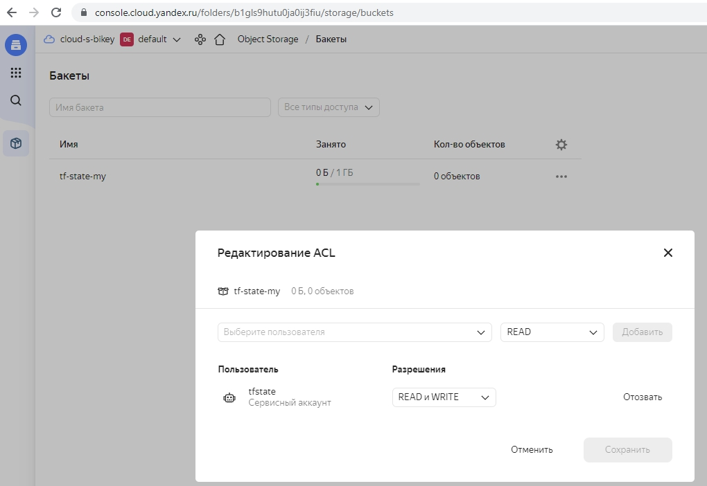
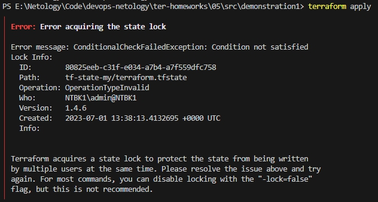

# Ответы на домашнее задание к занятию "Использование Terraform в команде"

### Цель задания

1. Научиться использовать remote state.
2. Освоить приемы командной работы.


### Чеклист готовности к домашнему заданию

1. Зарегистрирован аккаунт в Yandex Cloud. Использован промокод на грант.
2. Установлен инструмент Yandex CLI
3. Любые ВМ, использованные при выполнении задания должны быть прерываемыми, для экономии средств.

------


### Задание 1

1. Возьмите код:
- из [ДЗ к лекции №04](https://github.com/netology-code/ter-homeworks/tree/main/04/src) 
- из [демо к лекции №04](https://github.com/netology-code/ter-homeworks/tree/main/04/demonstration1).
2. Проверьте код с помощью tflint и checkov. Вам не нужно инициализировать этот проект.
3. Перечислите какие **типы** ошибок обнаружены в проекте (без дублей).

>Типы ошибок __tflint__:
>1. Warning: Missing version constraint for provider "_<proveder_name>_" in "required_providers" (terraform_required_providers)
>2. Warning: variable "_<variable_name>_" is declared but not used (terraform_unused_declarations)
>3. Warning: Module source "git::https://github.com/udjin10/yandex_compute_instance.git?ref=main" uses a default branch as ref (main) (terraform_module_pinned_source)

>Типы ошибок __checkov__:
>1. Check: CKV_YC_4: "Ensure compute instance does not have serial console enabled."
>2. Check: CKV_YC_4: "Ensure compute instance does not have serial console enabled."
>3. Check: CKV_YC_2: "Ensure compute instance does not have public IP."


------

### Задание 2

1. Возьмите ваш GitHub репозиторий с **выполненным ДЗ №4** в ветке 'terraform-04' и сделайте из него ветку 'terraform-05'
2. Повторите демонстрацию лекции: настройте YDB, S3 bucket, yandex service account, права доступа и мигрируйте State проекта в S3 с блокировками. Предоставьте скриншоты процесса в качестве ответа.




3. Закомитьте в ветку 'terraform-05' все изменения.

[Ветка terraform-05](https://github.com/nelucifers/devops-netology/tree/terraform-05/)

4. Откройте в проекте terraform console, а в другом окне из этой же директории попробуйте запустить terraform apply.
5. Пришлите ответ об ошибке доступа к State.



6. Принудительно разблокируйте State. Пришлите команду и вывод.

>terraform force-unlock 80825eeb-c31f-e034-a7b4-a7f559dfc758


------
### Задание 3  

1. Сделайте в GitHub из ветки 'terraform-05' новую ветку 'terraform-hotfix'.
2. Проверье код с помощью tflint и checkov, исправьте все предупреждения и ошибки в 'terraform-hotfix', сделайте комит.
3. Откройте новый pull request 'terraform-hotfix' --> 'terraform-05'. 
4. Вставьте в комментарий PR результат анализа tflint и checkov, план изменений инфраструктуры из вывода команды terraform plan.
5. Пришлите ссылку на PR для ревью(вливать код в 'terraform-05' не нужно).

[Pull request 'terraform-hotfix' --> 'terraform-05'](https://github.com/nelucifers/devops-netology/pull/1)

------
### Задание 4

1. Напишите переменные с валидацией и протестируйте их, заполнив default верными и неверными значениями. Предоставьте скриншоты проверок:

- type=string, description="ip-адрес", проверка что значение переменной содержит верный IP-адрес с помощью функций cidrhost() или regex(). Тесты:  "192.168.0.1" и "1920.1680.0.1"
- type=list(string), description="список ip-адресов", проверка что все адреса верны.  Тесты:  ["192.168.0.1", "1.1.1.1", "127.0.0.1"] и ["192.168.0.1", "1.1.1.1", "1270.0.0.1"]


## Дополнительные задания (со звездочкой*)

**Настоятельно рекомендуем выполнять все задания под звёздочкой.**   Их выполнение поможет глубже разобраться в материале.   
Задания под звёздочкой дополнительные (необязательные к выполнению) и никак не повлияют на получение вами зачета по этому домашнему заданию. 
------
### Задание 5*
1. Напишите переменные с валидацией:
- type=string, description="любая строка", проверка что строка не содержит в себе символов верхнего регистра
- type=object, проверка что введено только одно из опциональных значений по примеру:
```
variable "in_the_end_there_can_be_only_one" {
    description="Who is better Connor or Duncan?"
    type = object({
        Dunkan = optional(bool)
        Connor = optional(bool)
    })

    default = {
        Dunkan = true
        Connor = false
    }

    validation {
        error_message = "There can be only one MacLeod"
        condition = <проверка>
    }
}
```

>Результат:
```
variable "str" {
  type        = string
  default     = "test-string"

  validation {
      condition = var.str == lower(var.str)
      error_message = "String contains uppercase characters"
  }
}

variable "in_the_end_there_can_be_only_one" {
  description="Who is better Connor or Duncan?"
  type = object({
      Dunkan = optional(bool)
      Connor = optional(bool)
  })

  default = {
      Dunkan = true
      Connor = false
  }

  validation {
      error_message = "There can be only one MacLeod"
      condition = var.in_the_end_there_can_be_only_one.Dunkan != var.in_the_end_there_can_be_only_one.Connor
  }
}
```

------
### Задание 6**  

1. Настройте любую известную вам CI/CD систему.
2. Скачайте с ее помощью ваш репозиторий с кодом и инициализируйте инфраструктуру.
3. Уничтожтье инфраструктуру тем же способом.


### Правила приема работы

Ответы на задания и необходимые скриншоты оформите в md-файле в ветке terraform-05.

В качестве результата прикрепите ссылку на ветку terraform-05 в вашем репозитории.

**ВАЖНО!** Удалите все созданные ресурсы.

### Критерии оценки

Зачёт:

* выполнены все задания;
* ответы даны в развёрнутой форме;
* приложены соответствующие скриншоты и файлы проекта;
* в выполненных заданиях нет противоречий и нарушения логики.

На доработку:

* задание выполнено частично или не выполнено вообще;
* в логике выполнения заданий есть противоречия и существенные недостатки. 


