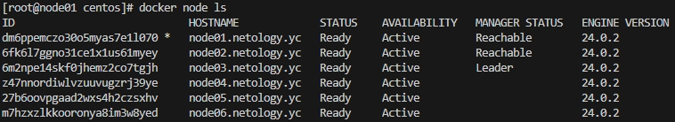
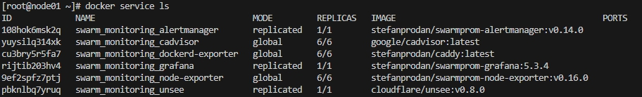

# Ответы на домашнее задание к занятию 5. «Оркестрация кластером Docker контейнеров на примере Docker Swarm»


## Задача 1

Дайте письменые ответы на вопросы:

- В чём отличие режимов работы сервисов в Docker Swarm-кластере: replication и global?

>В режиме replicated задается количесство реплик, которое необходимо, и задачи могут быть запущены на одной или на разных нодах. А в режиме global запускается по одной задаче на каждой ноде. 

- Какой алгоритм выбора лидера используется в Docker Swarm-кластере?

>В кластере лидер (master) выбирается самостоятельно, т.е. ноды, на которых будет запущена команда ```docker swarm init``` будут являться лидерами.

- Что такое Overlay Network?

>Overlay Network создаёт виртуальные сети для контейнеров, расположенных на разных хостах swarm-кластера. Это позволяет контейнерам взаимодействовать друг с другом внутри одной виртаульной сети.


## Задача 2

Создайте ваш первый Docker Swarm-кластер в Яндекс Облаке.

Чтобы получить зачёт, предоставьте скриншот из терминала (консоли) с выводом команды:
```
docker node ls
```




## Задача 3

Создайте ваш первый, готовый к боевой эксплуатации кластер мониторинга, состоящий из стека микросервисов.

Чтобы получить зачёт, предоставьте скриншот из терминала (консоли), с выводом команды:
```
docker service ls
```




## Задача 4 (*)

Выполните на лидере Docker Swarm-кластера команду, указанную ниже, и дайте письменное описание её функционала — что она делает и зачем нужна:
```
# см.документацию: https://docs.docker.com/engine/swarm/swarm_manager_locking/
docker swarm update --autolock=true
```

>На каждом лидере кластера сохраняется ключ TLS, используемый для шифрования связи между узлами swarm и ключ, используемый для шифрования и расшифровки журналов Raft. Команда ```docker swarm update --autolock=true``` позволяет защитить эти ключи и заблокировать docker swarm.
>
>При включенной блокировке, для доступа к docker swarm необходим токен, который выдается при её включении (его нужно надежно хранить). Это позволяет защититься сервис от злоумышенников.